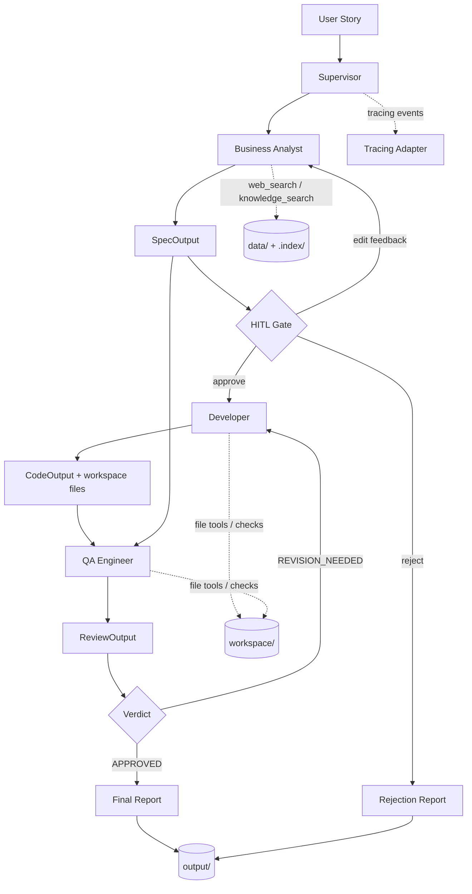

# Diploma Dev Team

Локальна мультиагентна система для дипломної теми “Команда розробки ПЗ”. Система імітує роботу невеликої software delivery team: перетворює `User Story` у структуровану специфікацію, генерує демо-реалізацію, виконує QA-рев’ю, підтримує revise loop і зберігає фінальний markdown-звіт.

## Короткий опис

Проєкт реалізує ізольований runtime для локального demo-сценарію:
- `Business Analyst` формує специфікацію
- `Developer` створює код і реальні файли у `workspace/`
- `QA Engineer` перевіряє результат і повертає structured review
- `Supervisor` керує маршрутизацією, HITL gate, revise loop, збереженням артефактів і tracing

Система не інтегрується в основний orchestration layer репозиторію і не змінює production-like code path.

## Архітектурний Патерн

Система поєднує два патерни:

- `Prompt chaining`
  - `User Story -> Business Analyst -> SpecOutput`
  - `Approved Spec -> Developer -> CodeOutput`
  - `Spec + Code -> QA Engineer -> ReviewOutput`
- `Evaluator-optimizer`
  - `QA Engineer` виступає evaluator
  - `Developer` виступає optimizer
  - якщо QA повертає `REVISION_NEEDED`, Supervisor відправляє feedback назад у Developer

Людина включена в процес через `HITL gate` між `Business Analyst` і `Developer`:
- `approve` -> продовжити розробку
- `edit` -> повернути feedback назад у BA
- `reject` -> завершити run без генерації коду

## Архітектурна Діаграма



## Structured Output Contracts

### `SpecOutput`

```python
class SpecOutput(BaseModel):
    title: str
    requirements: list[str]
    acceptance_criteria: list[str]
    estimated_complexity: Literal["simple", "medium", "complex"]
```

### `CodeOutput`

```python
class CodeOutput(BaseModel):
    source_code: str
    description: str
    files_created: list[str]
```

### `ReviewOutput`

```python
class ReviewOutput(BaseModel):
    verdict: Literal["APPROVED", "REVISION_NEEDED"]
    issues: list[str]
    suggestions: list[str]
    score: float
```

## Tools

### Business Analyst

- `web_search`
- `knowledge_search`

### Developer

- `web_search`
- `write_project_file`
- `list_project_files`
- `run_python_checks`

### QA Engineer

- `read_project_file`
- `list_project_files`
- `run_python_checks`

### Supervisor / Reporting

- `save_final_report`

## Як Працює RAG

Локальна knowledge base використовується насамперед для `Business Analyst`, щоб підживлювати специфікації проєктними стандартами та технічним контекстом.

Рекомендовані документи для [`diploma-dev-team/data/`](C:/work/my%20repositories/research-agent/diploma-dev-team/data):
- Python docs notes / stdlib notes
- style guide
- project coding standards
- framework docs notes
- architecture notes
- testing checklist
- code review checklist

Рекомендований обсяг:
- `10-30` документів

Підтримувані формати:
- `.md`
- `.txt`
- `.pdf`

Baseline ingest flow:
1. `ingest.py` читає документи з `data/`
2. Ріже їх на chunks
3. Створює embeddings
4. Зберігає `chunks.jsonl`, `faiss.index`, `manifest.json` у `.index/`

Fallback behavior:
- якщо документів немає, ingest не падає
- створюється `manifest.json` зі статусом `no_documents_found`
- runtime може працювати далі через web search і raw local fallback

## Як Запустити Систему

### 1. Встановити залежності

```powershell
pip install -r diploma-dev-team/requirements.txt
```

### 2. За бажанням зібрати локальний RAG-індекс

```powershell
python diploma-dev-team/ingest.py
```

### 3. Запустити локальний REPL demo

```powershell
python diploma-dev-team/main.py
```

### Optional MCP extension

Запуск MCP сервера:

```powershell
python diploma-dev-team/mcp_server.py
```

Щоб увімкнути MCP режим для агентів:

```powershell
$env:USE_MCP="true"
$env:MCP_URL="http://127.0.0.1:8910"
python diploma-dev-team/main.py
```

У цьому режимі tool layer для `web_search`, `knowledge_search`, `read_project_file`, `write_project_file` іде через FastMCP client. Якщо remote MCP недоступний, система автоматично відкотиться на локальні tools.

## Як Запустити Tests / Evals

### Deterministic baseline tests

```powershell
pytest diploma-dev-team/tests -q
```

### DeepEval-oriented run

```powershell
deepeval test run diploma-dev-team/tests/
```

Примітки:
- component і tool tests переважно deterministic
- частина evals використовує fake/stub-assisted baseline
- live DeepEval metrics є `opt-in`
- щоб явно увімкнути live judge layer, встанови:

```powershell
$env:DIPLOMA_ENABLE_LIVE_EVAL="1"
```

Якщо `deepeval` або доступ до judge-моделі недоступні:
- suite не валиться жорстко
- optional live-eval частина skip-ається коректно

## Як Працює Tracing

Система має реальний tracing wrapper у [`diploma-dev-team/tracing.py`](C:/work/my%20repositories/research-agent/diploma-dev-team/tracing.py).

Підтримувані режими:
- `noop`
- `langfuse`
- `langsmith` як lightweight placeholder

### Реальна Langfuse інтеграція

Як увімкнути:

```powershell
$env:TRACING_ENABLED="true"
$env:TRACING_BACKEND="langfuse"
$env:TRACING_PROJECT="diploma-dev-team"
$env:LANGFUSE_PUBLIC_KEY="pk-lf-..."
$env:LANGFUSE_SECRET_KEY="sk-lf-..."
$env:LANGFUSE_BASE_URL="https://cloud.langfuse.com"
```

Що логуються в traces:
- кожен агентний виклик `Business Analyst`, `Developer`, `QA Engineer`
- `agent_name`
- `iteration`
- `session_id`
- `input_preview`
- `output_preview`
- `latency_ms`
- supervisor events для ключових кроків pipeline
- event збереження фінального markdown report

Поведінка fail-safe:
- якщо tracing вимкнений, використовується no-op adapter
- якщо Langfuse ключів немає, runtime не падає і переходить у no-op
- якщо Langfuse SDK не встановлений, runtime не падає і переходить у no-op
- якщо emit у Langfuse завершується помилкою, pipeline продовжує працювати

### LangSmith

LangSmith лишається в проєкті як архітектурна точка розширення. Поточний дипломний baseline має реальну інтеграцію саме для Langfuse.

## Приклад User Story

```text
As a manager, I want to export tasks to CSV so that I can share reports with stakeholders.
```

## Приклад Expected Output

Типовий успішний результат demo-run:
- `Business Analyst` повертає `SpecOutput` з title, requirements, acceptance criteria, complexity
- користувач затверджує spec через `approve`
- `Developer` створює реальні файли у `workspace/`, наприклад:
  - `src/__init__.py`
  - `src/main.py`
  - `tests/test_main.py`
  - `requirements.txt`
  - `README.md`
- `QA Engineer` повертає `ReviewOutput` з `APPROVED` або `REVISION_NEEDED`
- `Supervisor` друкує фінальний summary і зберігає markdown report у `output/`

Приклад фінального summary:

```text
Spec: Export Tasks to CSV
Complexity: medium
Created Files:
- src/__init__.py
- src/main.py
- tests/test_main.py
- requirements.txt
- README.md
QA Verdict: APPROVED
Iterations: 2
Report Saved: diploma-dev-team/output/export-tasks-to-csv-approved.md
```

## Обмеження Системи

- це demo-oriented baseline, а не production delivery platform
- generated code є спрощеним і призначений для демонстрації пайплайну
- `run_python_checks` використовує baseline safety guards, а не повний sandbox
- RAG якість напряму залежить від якості локальних документів
- revise loop обмежений `5` ітераціями
- Langfuse інтеграція є мінімальною і навмисно зосереджена на агентних викликах, а не на повному автоматичному трасуванні всіх внутрішніх LangChain подій
- eval layer частково deterministic і частково optional, щоб бути стабільним локально

## Можливі Майбутні Покращення

- повноцінна інтеграція з Langfuse або LangSmith
- richer code generation для multi-file Python apps
- розширення QA на static analysis, pytest execution і coverage
- кращий project template selection залежно від типу user story
- окремі domain-specific RAG collections для BA, Developer і QA
- web UI поверх локального REPL
- persistent run history і artifact catalog
- ACP/MCP версія цієї ж дипломної системи

## MCP Bonus Extension

У проєкті є мінімальна optional MCP інтеграція як бонусний шар розділення tools:

- сервер: [`diploma-dev-team/mcp_server.py`](C:/work/my%20repositories/research-agent/diploma-dev-team/mcp_server.py)
- transport: FastMCP over HTTP
- endpoint: `http://127.0.0.1:8910/mcp`

Експортовані MCP tools:
- `web_search`
- `knowledge_search`
- `read_project_file`
- `write_project_file`

Поводження runtime:
- `USE_MCP=false` -> `[MCP] using local tools`
- `USE_MCP=true` -> `[MCP] using remote tools`
- якщо remote client/server недоступний, runtime друкує повідомлення і fallback-иться на локальні tools без зупинки main flow

## Git-like Workflow Bonus

Проєкт також містить локальний симулятор Git/PR workflow у [`diploma-dev-team/git_simulator.py`](C:/work/my%20repositories/research-agent/diploma-dev-team/git_simulator.py).

Що імітується:
- `create_branch(name)`
- `create_commit(files)`
- `open_pr(description)`
- `review_pr(review_output)`
- `merge_pr()`

Як це вбудовано в pipeline:
- після затвердження spec Supervisor створює feature branch
- після кожної Developer-ітерації створюється commit
- після першої Developer-ітерації відкривається PR
- після кожного QA review PR отримує review status
- якщо QA повертає `APPROVED`, PR auto-merge-иться

Консольні події:

```text
[GIT] branch created
[GIT] commit created
[GIT] PR opened
[GIT] PR approved
[GIT] merged
```

Історія симуляції зберігається в:
- [`diploma-dev-team/output/git_log.json`](C:/work/my%20repositories/research-agent/diploma-dev-team/output/git_log.json)
